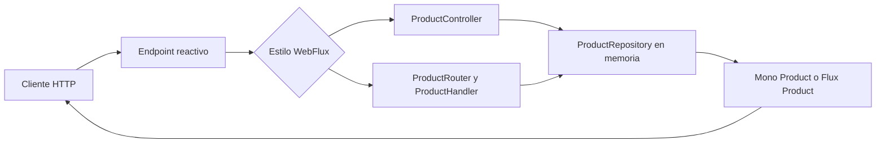

# API de productos — Controllers y endpoints funcionales con Spring WebFlux

## Arquitectura del laboratorio



Ambos estilos exponen el mismo dominio y comparten el repositorio. La diferencia está en cómo se declaran las rutas y las respuestas, no en el modelo reactivo.

## 1. Metadatos

| Campo | Valor |
|---|---|
| **Duración** | 80 minutos |
| **Complejidad** | Media |
| **Nivel Bloom** | Aplicar (*Apply*) |
| **Módulo** | 2 — Spring WebFlux: APIs REST no bloqueantes |
| **Proyecto** | `reactive-store` |
| **Paquete base** | `com.netec.reactivestore` |
| **Lab anterior** | Capítulo 1: Mono, Flux y operadores base |

## 2. Descripción general

En esta práctica continuarás el proyecto `reactive-store` y construirás una API de productos en memoria. Implementarás el mismo recurso con un controller anotado y con `RouterFunction`/`HandlerFunction`, agregarás streaming SSE, validación, manejo de errores y consumo no bloqueante de una API externa mediante `WebClient`.

Contrato de continuidad:

- Proyecto y carpeta: `reactive-store`
- Paquete base: `com.netec.reactivestore`
- Entidad principal: `Product`
- Endpoint anotado: `/api/products`
- Endpoint funcional de comparación: `/functional/products`
- Puerto: `${SERVER_PORT:8080}`
- Base URL: `${API_BASE_URL:http://localhost:8080}`
- Java: 21 LTS
- Spring Boot: 3.3.5
- Build tool: Maven

> `block()`, `blockFirst()` y `blockLast()` no deben usarse dentro de controllers, handlers, servicios ni pipelines de producción.

## 3. Objetivos de aprendizaje

- Implementar CRUD reactivo con `@RestController`.
- Implementar las mismas operaciones con `RouterFunction` y `HandlerFunction`.
- Usar `Mono<Product>` y `Flux<Product>` según la cardinalidad.
- Validar requests y devolver errores con `ProblemDetail`.
- Exponer un stream SSE.
- Consumir una API externa con `WebClient`, timeout y fallback.

## 4. Prerrequisitos

- Proyecto `reactive-store` creado en el capítulo 1.
- JDK 21 y Maven 3.9.x.
- Comprensión básica de HTTP, JSON, `Mono` y `Flux`.
- Conexión a Internet para Maven y para la API de ejemplo, o un servicio simulado indicado por el instructor.

## 5. Configuración del proyecto

Si no conservaste el proyecto anterior, genera la misma base:

```bash
curl -s "https://start.spring.io/starter.tgz" \
  -d type=maven-project \
  -d language=java \
  -d bootVersion=3.3.5 \
  -d baseDir=reactive-store \
  -d groupId=com.netec \
  -d artifactId=reactive-store \
  -d name=reactive-store \
  -d packageName=com.netec.reactivestore \
  -d javaVersion=21 \
  -d dependencies=webflux,validation \
  | tar -xzvf -
```

Dependencias requeridas:

```xml
<dependency>
    <groupId>org.springframework.boot</groupId>
    <artifactId>spring-boot-starter-webflux</artifactId>
</dependency>
<dependency>
    <groupId>org.springframework.boot</groupId>
    <artifactId>spring-boot-starter-validation</artifactId>
</dependency>
<dependency>
    <groupId>org.springframework.boot</groupId>
    <artifactId>spring-boot-starter-test</artifactId>
    <scope>test</scope>
</dependency>
<dependency>
    <groupId>io.projectreactor</groupId>
    <artifactId>reactor-test</artifactId>
    <scope>test</scope>
</dependency>
```

`src/main/resources/application.properties`:

```properties
spring.application.name=reactive-store
server.port=${SERVER_PORT:8080}
external.api.url=${EXTERNAL_API_URL:https://dummyjson.com}
```

## 6. Pasos del laboratorio

### Bloque 1 — Modelo y repositorio en memoria (20 minutos)

`src/main/java/com/netec/reactivestore/model/Product.java`:

```java
package com.netec.reactivestore.model;

import java.math.BigDecimal;

public record Product(
    String id,
    String name,
    String description,
    BigDecimal price,
    Integer stock,
    Boolean active
) {}
```

`src/main/java/com/netec/reactivestore/dto/ProductRequest.java`:

```java
package com.netec.reactivestore.dto;

import jakarta.validation.constraints.DecimalMin;
import jakarta.validation.constraints.Min;
import jakarta.validation.constraints.NotBlank;
import jakarta.validation.constraints.NotNull;
import jakarta.validation.constraints.Size;
import java.math.BigDecimal;

public record ProductRequest(
    @NotBlank @Size(max = 120) String name,
    @Size(max = 500) String description,
    @NotNull @DecimalMin("0.01") BigDecimal price,
    @NotNull @Min(0) Integer stock,
    Boolean active
) {}
```

`src/main/java/com/netec/reactivestore/repository/ProductRepository.java`:

```java
package com.netec.reactivestore.repository;

import com.netec.reactivestore.dto.ProductRequest;
import com.netec.reactivestore.model.Product;
import org.springframework.stereotype.Repository;
import reactor.core.publisher.Flux;
import reactor.core.publisher.Mono;

import java.math.BigDecimal;
import java.util.Map;
import java.util.UUID;
import java.util.concurrent.ConcurrentHashMap;

@Repository
public class ProductRepository {

    private final Map<String, Product> store = new ConcurrentHashMap<>();

    public ProductRepository() {
        Product first = new Product(UUID.randomUUID().toString(),
            "Laptop Pro", "Equipo para desarrollo",
            new BigDecimal("1299.99"), 12, true);
        Product second = new Product(UUID.randomUUID().toString(),
            "Monitor 4K", "Monitor IPS",
            new BigDecimal("449.99"), 8, true);
        store.put(first.id(), first);
        store.put(second.id(), second);
    }

    public Flux<Product> findAll() {
        return Flux.fromIterable(store.values());
    }

    public Mono<Product> findById(String id) {
        return Mono.justOrEmpty(store.get(id));
    }

    public Mono<Product> save(ProductRequest request) {
        return Mono.fromSupplier(() -> {
            String id = UUID.randomUUID().toString();
            Product product = new Product(id, request.name(), request.description(),
                request.price(), request.stock(),
                request.active() == null || request.active());
            store.put(id, product);
            return product;
        });
    }

    public Mono<Product> update(String id, ProductRequest request) {
        return findById(id).map(existing -> {
            Product updated = new Product(id, request.name(), request.description(),
                request.price(), request.stock(),
                request.active() == null ? existing.active() : request.active());
            store.put(id, updated);
            return updated;
        });
    }

    public Mono<Boolean> deleteById(String id) {
        return Mono.fromSupplier(() -> store.remove(id) != null);
    }
}
```

### Bloque 2 — Controller anotado (20 minutos)

`src/main/java/com/netec/reactivestore/controller/ProductController.java`:

```java
package com.netec.reactivestore.controller;

import com.netec.reactivestore.dto.ProductRequest;
import com.netec.reactivestore.exception.ProductNotFoundException;
import com.netec.reactivestore.model.Product;
import com.netec.reactivestore.repository.ProductRepository;
import jakarta.validation.Valid;
import org.springframework.http.HttpStatus;
import org.springframework.http.MediaType;
import org.springframework.http.ResponseEntity;
import org.springframework.web.bind.annotation.*;
import reactor.core.publisher.Flux;
import reactor.core.publisher.Mono;

import java.time.Duration;

@RestController
@RequestMapping("/api/products")
public class ProductController {

    private final ProductRepository repository;

    public ProductController(ProductRepository repository) {
        this.repository = repository;
    }

    @GetMapping
    public Flux<Product> findAll() {
        return repository.findAll();
    }

    @GetMapping("/{id}")
    public Mono<Product> findById(@PathVariable String id) {
        return repository.findById(id)
            .switchIfEmpty(Mono.error(new ProductNotFoundException(id)));
    }

    @PostMapping
    @ResponseStatus(HttpStatus.CREATED)
    public Mono<Product> create(@Valid @RequestBody ProductRequest request) {
        return repository.save(request);
    }

    @PutMapping("/{id}")
    public Mono<Product> update(
            @PathVariable String id,
            @Valid @RequestBody ProductRequest request) {
        return repository.update(id, request)
            .switchIfEmpty(Mono.error(new ProductNotFoundException(id)));
    }

    @DeleteMapping("/{id}")
    public Mono<ResponseEntity<Void>> delete(@PathVariable String id) {
        return repository.deleteById(id)
            .map(deleted -> deleted
                ? ResponseEntity.noContent().build()
                : ResponseEntity.notFound().build());
    }

    @GetMapping(value = "/stream", produces = MediaType.TEXT_EVENT_STREAM_VALUE)
    public Flux<Product> stream() {
        return repository.findAll().delayElements(Duration.ofSeconds(1));
    }
}
```

### Bloque 3 — RouterFunction, HandlerFunction y errores (20 minutos)

Las rutas funcionales se mantienen bajo `/functional/products` para comparar estilos sin colisionar con el endpoint canónico `/api/products`.

`ProductHandler` debe recibir `ServerRequest`, validar el `ProductRequest` con un `Validator` y devolver `Mono<ServerResponse>`. El router mantiene estos contratos:

```java
@Bean
RouterFunction<ServerResponse> productRoutes(ProductHandler handler) {
    return RouterFunctions.route()
        .GET("/functional/products", handler::findAll)
        .GET("/functional/products/{id}", handler::findById)
        .POST("/functional/products", handler::create)
        .PUT("/functional/products/{id}", handler::update)
        .DELETE("/functional/products/{id}", handler::delete)
        .GET("/functional/products/stream",
            RequestPredicates.accept(MediaType.TEXT_EVENT_STREAM),
            handler::stream)
        .build();
}
```

`src/main/java/com/netec/reactivestore/exception/ProductNotFoundException.java`:

```java
package com.netec.reactivestore.exception;

public class ProductNotFoundException extends RuntimeException {
    public ProductNotFoundException(String id) {
        super("Producto no encontrado: " + id);
    }
}
```

`src/main/java/com/netec/reactivestore/exception/GlobalExceptionHandler.java`:

```java
package com.netec.reactivestore.exception;

import org.springframework.http.HttpStatus;
import org.springframework.http.ProblemDetail;
import org.springframework.web.bind.annotation.ExceptionHandler;
import org.springframework.web.bind.annotation.RestControllerAdvice;
import org.springframework.web.bind.support.WebExchangeBindException;

@RestControllerAdvice
public class GlobalExceptionHandler {

    @ExceptionHandler(ProductNotFoundException.class)
    ProblemDetail handleNotFound(ProductNotFoundException ex) {
        return ProblemDetail.forStatusAndDetail(HttpStatus.NOT_FOUND, ex.getMessage());
    }

    @ExceptionHandler(WebExchangeBindException.class)
    ProblemDetail handleValidation(WebExchangeBindException ex) {
        return ProblemDetail.forStatusAndDetail(
            HttpStatus.BAD_REQUEST, "La solicitud contiene campos inválidos");
    }

    @ExceptionHandler(Exception.class)
    ProblemDetail handleUnexpected(Exception ex) {
        // Registra el error interno en el servidor sin devolver el stack trace.
        return ProblemDetail.forStatusAndDetail(
            HttpStatus.INTERNAL_SERVER_ERROR,
            "Ocurrió un error inesperado. Usa el identificador de seguimiento.");
    }
}
```

### Bloque 4 — WebClient no bloqueante (20 minutos)

Configura la URL externa mediante `${EXTERNAL_API_URL}`:

```java
@Bean
WebClient externalApiClient(
        WebClient.Builder builder,
        @Value("${external.api.url}") String externalApiUrl) {
    return builder.baseUrl(externalApiUrl).build();
}
```

El servicio debe retornar el publisher al controller y reintentar únicamente fallos transitorios:

```java
public Mono<ProductResponse> enrich(Product product) {
    return webClient.get()
        .uri("/products/{id}", product.id())
        .retrieve()
        .bodyToMono(ExternalProductResponse.class)
        .timeout(Duration.ofSeconds(3))
        .retryWhen(Retry.backoff(2, Duration.ofMillis(300))
            .filter(this::isTransientFailure))
        .map(external -> ProductResponse.from(product, external))
        .onErrorResume(ex -> Mono.just(ProductResponse.fromLocal(product)));
}
```

No registres tokens, cabeceras de autorización ni cuerpos sensibles.

## 7. Validación

```bash
mvn clean test
mvn spring-boot:run

curl -s http://localhost:8080/api/products
curl -N -H "Accept: text/event-stream" \
  http://localhost:8080/api/products/stream
curl -s http://localhost:8080/functional/products
```

PowerShell:

```powershell
Invoke-RestMethod -Uri "http://localhost:8080/api/products"
Invoke-RestMethod -Uri "http://localhost:8080/functional/products"
```

## 8. Resultado esperado

- El proyecto sigue llamándose `reactive-store`.
- Todos los paquetes comienzan con `com.netec.reactivestore`.
- El recurso principal es `Product`.
- `/api/products` es el endpoint canónico.
- Los endpoints funcionales demuestran el estilo Router/Handler sin crear otro proyecto.
- No se usa `block()` ni `subscribe()` en controllers, handlers o servicios.

## 9. Continuidad

Conserva el proyecto. El capítulo 3 reemplazará el repositorio en memoria por persistencia reactiva y mantendrá el mismo dominio, paquete y endpoint.

## 10. Guía didáctica de cierre

### Escenario y objetivo operativo

El catálogo debe publicarse antes de conectar una base de datos. Al finalizar debes demostrar CRUD bajo `/api/products`, comparación con `/functional/products`, validaciones 400, errores 404, streaming SSE y una integración WebClient sin bloqueo.

### Cómo leer el flujo

1. `Flux<Product>` expresa una colección de cero a muchos elementos.
2. `Mono<Product>` expresa un producto opcional.
3. `switchIfEmpty` convierte ausencia en error de dominio.
4. `flatMap` encadena operaciones que retornan publishers.
5. Spring WebFlux se suscribe al publisher retornado por el controller.

El controller anotado y RouterFunction son dos formas de expresar el mismo contrato. Ninguno es inherentemente más reactivo. En handlers funcionales, `bodyToMono` deserializa, pero la validación debe invocarse explícitamente con `Validator`.

### Validación final observable

- [ ] Ambos estilos listan productos con el mismo contrato.
- [ ] Un ID inexistente retorna 404.
- [ ] Un request inválido retorna 400.
- [ ] El SSE entrega eventos separados.
- [ ] Un fallo externo activa fallback sin usar `block()`.

### Solución de problemas

- Si el handler acepta datos inválidos, ejecuta Bean Validation explícitamente.
- Si SSE llega como arreglo, usa `Accept: text/event-stream` y un cliente que no acumule toda la respuesta.
- Si WebClient siempre usa fallback, verifica `${EXTERNAL_API_URL}` y el path.
- Si aparece un error de bloqueo, busca `block()`, `blockFirst()` y `blockLast()` en controllers y servicios.

### Preguntas de reflexión

1. ¿Qué estilo hace más visibles todas las rutas?
2. ¿Por qué WebClient requiere `flatMap` al combinarse con una búsqueda local?
3. ¿Qué diferencia hay entre un 404 local y un timeout externo?
4. ¿Qué partes del repositorio en memoria siguen siendo sincrónicas?
5. ¿Cuándo elegirías Spring MVC para esta API?

### Limpieza

Detén la aplicación con `Ctrl+C`. No elimines `reactive-store`; se usará en el capítulo 3.

## 11. Compatibilidad y seguridad

Si el comando de Spring Initializr con `curl | tar` no funciona, genera el ZIP desde `https://start.spring.io` con los mismos valores y descomprímelo desde el explorador o el IDE.

PowerShell para crear un producto:

```powershell
$body = @{
  name = "Webcam HD"
  description = "Webcam 1080p"
  price = 79.99
  stock = 10
  active = $true
} | ConvertTo-Json

Invoke-RestMethod `
  -Method Post `
  -Uri "http://localhost:8080/api/products" `
  -ContentType "application/json" `
  -Body $body
```

No registres tokens, cookies, cuerpos sensibles ni cabeceras `Authorization`. Mantén `${EXTERNAL_API_URL}` fuera del código si incorpora datos propios del entorno.
