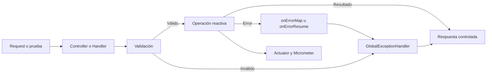

# Tests, métricas y troubleshooting en Reactive Store

## Flujo de validación y errores



Las pruebas verifican tanto el resultado funcional como las señales del publisher. Actuator y Micrometer permiten observar el comportamiento sin introducir lógica bloqueante.

## Metadatos

| Campo | Valor |
|---|---|
| **Duración** | 100 minutos |
| **Complejidad** | Alta |
| **Nivel Bloom** | Aplicar (*Apply*) |
| **Proyecto** | `reactive-store` |
| **Paquete base** | `com.netec.reactivestore` |
| **Lab previo** | Capítulo 3: persistencia reactiva |
| **Spring Boot** | 3.3.5 |

## Descripción general

En este laboratorio ampliarás el mismo proyecto `reactive-store` con pruebas unitarias e integración, Actuator, métricas con Micrometer y ejercicios de troubleshooting reactivo. Se mantienen el dominio `Product`, el paquete `com.netec.reactivestore` y el endpoint `/api/products`.

> `block()`, `blockFirst()` y `blockLast()` no deben usarse en controllers, handlers, servicios ni repositorios reactivos.

## Objetivos

- Probar publishers con `StepVerifier` y tiempo virtual.
- Probar endpoints con `WebTestClient`.
- Validar SSE como flujo y no como lista bloqueante.
- Configurar Actuator y métricas de negocio.
- Identificar bloqueo accidental, uso incorrecto de schedulers y pérdida de contexto.

## Prerrequisitos

- Proyecto `reactive-store` del capítulo 3.
- JDK 21, Maven 3.9.x y Docker cuando se use observabilidad local.
- `ProductService`, `ProductRepository`, `ProductController` y `GlobalExceptionHandler`.

## Dependencias

```xml
<dependency>
    <groupId>io.projectreactor</groupId>
    <artifactId>reactor-test</artifactId>
    <scope>test</scope>
</dependency>
<dependency>
    <groupId>org.springframework.boot</groupId>
    <artifactId>spring-boot-starter-test</artifactId>
    <scope>test</scope>
</dependency>
<dependency>
    <groupId>org.springframework.boot</groupId>
    <artifactId>spring-boot-starter-actuator</artifactId>
</dependency>
<dependency>
    <groupId>io.micrometer</groupId>
    <artifactId>micrometer-registry-prometheus</artifactId>
</dependency>
<dependency>
    <groupId>io.r2dbc</groupId>
    <artifactId>r2dbc-h2</artifactId>
    <scope>test</scope>
</dependency>
```

## Bloque 1 — Tests unitarios con StepVerifier (25 minutos)

Ruta:

`src/test/java/com/netec/reactivestore/service/ProductServiceTest.java`

```java
package com.netec.reactivestore.service;

import com.netec.reactivestore.exception.ProductNotFoundException;
import com.netec.reactivestore.model.Product;
import com.netec.reactivestore.repository.ProductRepository;
import org.junit.jupiter.api.Test;
import org.junit.jupiter.api.extension.ExtendWith;
import org.mockito.Mock;
import org.mockito.junit.jupiter.MockitoExtension;
import reactor.core.publisher.Flux;
import reactor.core.publisher.Mono;
import reactor.test.StepVerifier;

import java.math.BigDecimal;

import static org.mockito.Mockito.when;

@ExtendWith(MockitoExtension.class)
class ProductServiceTest {

    @Mock
    ProductRepository repository;

    @Test
    void findAll_emiteProductosYCompleta() {
        Product product = new Product(
            "prod-001", "Laptop Pro", "Equipo para desarrollo",
            new BigDecimal("1299.99"), 10, true);
        when(repository.findAll()).thenReturn(Flux.just(product));

        StepVerifier.create(repository.findAll())
            .expectNext(product)
            .verifyComplete();
    }

    @Test
    void findById_emiteErrorCuandoNoExiste() {
        when(repository.findById("missing")).thenReturn(Mono.empty());

        Mono<Product> result = repository.findById("missing")
            .switchIfEmpty(Mono.error(new ProductNotFoundException("missing")));

        StepVerifier.create(result)
            .expectError(ProductNotFoundException.class)
            .verify();
    }
}
```

Para operadores temporales:

```java
StepVerifier.withVirtualTime(() ->
        Flux.just("A", "B").delayElements(Duration.ofSeconds(1)))
    .expectSubscription()
    .thenAwait(Duration.ofSeconds(2))
    .expectNext("A", "B")
    .verifyComplete();
```

Usa siempre un `Supplier` con `withVirtualTime`.

## Bloque 2 — Tests con WebTestClient (25 minutos)

Ruta:

`src/test/java/com/netec/reactivestore/controller/ProductControllerTest.java`

```java
package com.netec.reactivestore.controller;

import com.netec.reactivestore.exception.GlobalExceptionHandler;
import com.netec.reactivestore.exception.ProductNotFoundException;
import com.netec.reactivestore.model.Product;
import com.netec.reactivestore.service.ProductService;
import org.junit.jupiter.api.Test;
import org.springframework.beans.factory.annotation.Autowired;
import org.springframework.boot.test.autoconfigure.web.reactive.WebFluxTest;
import org.springframework.boot.test.mock.mockito.MockBean;
import org.springframework.context.annotation.Import;
import org.springframework.http.MediaType;
import org.springframework.test.web.reactive.server.WebTestClient;
import reactor.core.publisher.Flux;
import reactor.core.publisher.Mono;
import reactor.test.StepVerifier;

import java.math.BigDecimal;

import static org.mockito.Mockito.when;

@WebFluxTest(ProductController.class)
@Import(GlobalExceptionHandler.class)
class ProductControllerTest {

    @Autowired
    WebTestClient webTestClient;

    @MockBean
    ProductService service;

    @Test
    void getById_retornaProducto() {
        Product product = new Product(
            "prod-001", "Laptop Pro", "Equipo para desarrollo",
            new BigDecimal("1299.99"), 10, true);
        when(service.findById("prod-001")).thenReturn(Mono.just(product));

        webTestClient.get()
            .uri("/api/products/prod-001")
            .exchange()
            .expectStatus().isOk()
            .expectBody()
            .jsonPath("$.name").isEqualTo("Laptop Pro");
    }

    @Test
    void getById_retorna404() {
        when(service.findById("missing"))
            .thenReturn(Mono.error(new ProductNotFoundException("missing")));

        webTestClient.get()
            .uri("/api/products/missing")
            .exchange()
            .expectStatus().isNotFound();
    }

    @Test
    void stream_emiteSse() {
        Product first = new Product(
            "prod-001", "Laptop", "Equipo",
            new BigDecimal("999.99"), 10, true);
        Product second = new Product(
            "prod-002", "Monitor", "Pantalla",
            new BigDecimal("399.99"), 5, true);
        when(service.streamAllProducts()).thenReturn(Flux.just(first, second));

        Flux<Product> body = webTestClient.get()
            .uri("/api/products/stream")
            .accept(MediaType.TEXT_EVENT_STREAM)
            .exchange()
            .expectStatus().isOk()
            .returnResult(Product.class)
            .getResponseBody();

        StepVerifier.create(body)
            .expectNext(first, second)
            .verifyComplete();
    }
}
```

No uses `assert` del lenguaje Java para estos tests; utiliza AssertJ, JUnit Assertions o las aserciones de WebTestClient.

## Bloque 3 — Actuator y Micrometer (25 minutos)

`src/main/resources/application.yml`:

```yaml
management:
  endpoints:
    web:
      exposure:
        include: health,info,metrics,prometheus
  endpoint:
    health:
      show-details: when-authorized
```

Métrica de negocio:

```java
@Service
public class ProductService {

    private final ProductRepository repository;
    private final Counter productsCreated;

    public ProductService(ProductRepository repository, MeterRegistry registry) {
        this.repository = repository;
        this.productsCreated = Counter.builder("reactive_store_products_created")
            .description("Productos creados correctamente")
            .register(registry);
    }

    public Mono<Product> save(Product product) {
        return repository.save(product)
            .doOnSuccess(saved -> productsCreated.increment());
    }
}
```

Configuración opcional de Prometheus:

```yaml
services:
  prometheus:
    image: prom/prometheus:v2.51.0
    ports:
      - "9090:9090"
    volumes:
      - ./prometheus.yml:/etc/prometheus/prometheus.yml:ro
    extra_hosts:
      - "host.docker.internal:host-gateway"
```

`prometheus.yml`:

```yaml
global:
  scrape_interval: 15s

scrape_configs:
  - job_name: reactive-store
    metrics_path: /actuator/prometheus
    static_configs:
      - targets: ["host.docker.internal:8080"]
```

No incluyas contraseñas fijas de Grafana. Usa `${GRAFANA_ADMIN_PASSWORD}` si Grafana forma parte del entorno del instructor.

## Bloque 4 — Troubleshooting reactivo (25 minutos)

### Antipatrón 1: bloqueo en el event loop

Incorrecto:

```java
@GetMapping("/{id}")
Product findById(@PathVariable String id) {
    return service.findById(id).block();
}
```

Correcto:

```java
@GetMapping("/{id}")
Mono<Product> findById(@PathVariable String id) {
    return service.findById(id);
}
```

### Antipatrón 2: operación bloqueante en scheduler incorrecto

Si una librería bloqueante heredada no puede reemplazarse todavía:

```java
Mono.fromCallable(() -> legacyClient.loadProduct(id))
    .subscribeOn(Schedulers.boundedElastic());
```

Esto es una estrategia de aislamiento, no convierte la operación en no bloqueante.

### Antipatrón 3: ThreadLocal en un pipeline

Usa Reactor `Context`:

```java
Mono.deferContextual(context -> {
        String traceId = context.getOrDefault("traceId", "missing");
        return service.findById(id)
            .doOnNext(product -> log.info("[traceId={}] Producto {}", traceId, id));
    })
    .contextWrite(Context.of("traceId", requestTraceId));
```

## Validación

Bash:

```bash
mvn clean test
curl -s http://localhost:8080/actuator/health
curl -s http://localhost:8080/actuator/prometheus
curl -N -H "Accept: text/event-stream" \
  http://localhost:8080/api/products/stream
```

PowerShell:

```powershell
mvn clean test
Invoke-RestMethod -Uri "http://localhost:8080/actuator/health"
Invoke-WebRequest -Uri "http://localhost:8080/actuator/prometheus"
```

## Resultado esperado

- Los tests unitarios y de WebFlux pasan.
- Los tests usan los paquetes y contratos del capítulo 3.
- `/actuator/health` y `/actuator/prometheus` están disponibles según el perfil.
- El stream SSE se valida como publisher.
- El proyecto conserva `reactive-store`, `com.netec.reactivestore` y `/api/products`.

## Limpieza

```bash
docker compose -f docker/docker-compose-observability.yml down
mvn clean
```

No ejecutes limpiezas globales como `docker image prune` como parte obligatoria del laboratorio.

## Guía didáctica de cierre

### Escenario y objetivo operativo

La API funciona, pero el equipo necesita evidencia de regresión y señales para diagnosticarla. Debes entregar pruebas deterministas, health checks, métricas y una explicación de los antipatrones corregidos.

### Evidencia por bloque

- StepVerifier valida `onNext`, `onComplete` y `onError` sin `block()`.
- WebTestClient valida status, body y SSE.
- Actuator y Micrometer muestran estado y comportamiento.
- Troubleshooting demuestra por qué código que compila puede degradarse bajo concurrencia.

### Validación final observable

- [ ] `mvn clean test` termina correctamente.
- [ ] El SSE se prueba con `returnResult` y StepVerifier.
- [ ] Los operadores temporales usan tiempo virtual.
- [ ] Health no expone detalles sensibles públicamente.
- [ ] La métrica aumenta después de crear un producto.

### Solución de problemas

- Si `@WebFluxTest` no encuentra el servicio, agrega `@MockBean ProductService`.
- Si el advice no participa, importa `GlobalExceptionHandler`.
- Si una prueba SSE no termina, cancélala después de la evidencia requerida.
- Si Prometheus no muestra la métrica, verifica dependencia, exposición y registro del meter.

### Preguntas de reflexión

1. ¿Qué diferencia hay entre una prueba de servicio y una prueba HTTP?
2. ¿Por qué convertir SSE en lista no demuestra streaming?
3. ¿Qué información debe ocultar un health check público?
4. ¿Por qué `boundedElastic` es aislamiento y no I/O no bloqueante?
5. ¿Qué señal usarías para detectar saturación del event loop?

Conserva las pruebas y la configuración para el proyecto integrador.

## Seguridad de observabilidad

- No publiques Actuator directamente a Internet.
- Limita los endpoints expuestos y conserva `show-details: when-authorized`.
- Protege health y métricas mediante red interna o Spring Security cuando aplique.
- No incluyas contraseñas fijas de Grafana.
- Los logs de troubleshooting no deben contener tokens, cookies, cuerpos completos ni cabeceras `Authorization`.
