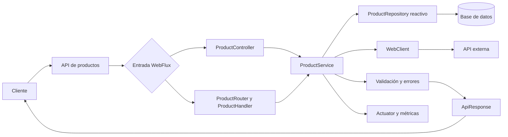

# Proyecto integrador — Reactive Store

## Arquitectura final



El proyecto final reúne las capas construidas en los capítulos anteriores y mantiene una sola cadena reactiva desde la entrada HTTP hasta persistencia, integración externa y respuesta.

## Metadatos

| Campo | Valor |
|---|---|
| **Duración** | 30 minutos |
| **Complejidad** | Alta |
| **Nivel Bloom** | Crear |
| **Proyecto** | `reactive-store` |
| **Paquete base** | `com.netec.reactivestore` |
| **Lab anterior** | Capítulo 4: pruebas, métricas y troubleshooting |

## Descripción general

En este laboratorio integrador completarás y validarás el mismo proyecto `reactive-store`. No crearás una aplicación nueva. Consolidarás la API de productos desarrollada en los capítulos anteriores: persistencia reactiva, endpoints WebFlux, integración externa con WebClient, manejo de errores, tests y observabilidad.

La duración de 30 minutos presupone que los capítulos 1 a 4 están terminados. Esta fase se enfoca en integración, validación y evidencia, no en volver a escribir todo el proyecto.

Contrato canónico:

- Carpeta: `reactive-store`
- Paquete: `com.netec.reactivestore`
- Entidad: `Product`
- Endpoint: `/api/products`
- Puerto: `${SERVER_PORT:8080}`
- Base URL: `${API_BASE_URL:http://localhost:8080}`
- Base de datos: `${DATABASE_URL}`
- API externa: `${EXTERNAL_API_URL}`
- Perfil: `${PROFILE_NAME:local}`
- Java 21 LTS, Spring Boot 3.3.5 y Maven

## Objetivos de aprendizaje

- Integrar las capas existentes de `reactive-store`.
- Validar ausencia de operaciones bloqueantes.
- Verificar persistencia reactiva y WebClient.
- Ejecutar tests con StepVerifier y WebTestClient.
- Comprobar health checks y métricas.
- Completar un checklist final de calidad.

## Prerrequisitos

- Capítulos 1 a 4 completados sobre el mismo proyecto.
- PostgreSQL o el motor reactivo definido en el capítulo 3.
- Maven, JDK 21 y Docker si se usa infraestructura local.
- Variables de entorno configuradas para credenciales.

## Arquitectura esperada

```text
Cliente HTTP
    → ProductController o ProductRouter/ProductHandler
    → ProductService
    → ProductRepository reactivo
    → PostgreSQL/MongoDB
    → ProductResponse / ApiResponse

ProductService
    → WebClient
    → API externa
    → timeout / retry selectivo / fallback
```

## Estructura mínima

```text
reactive-store/
├── pom.xml
├── src/main/java/com/netec/reactivestore/
│   ├── ReactiveStoreApplication.java
│   ├── client/
│   ├── config/
│   ├── controller/
│   ├── dto/
│   ├── exception/
│   ├── handler/
│   ├── model/
│   ├── repository/
│   ├── router/
│   └── service/
├── src/main/resources/
│   ├── application.yml
│   └── schema.sql
└── src/test/java/com/netec/reactivestore/
```

## Paso 1 — Verificar dependencias y configuración

El POM debe usar una única versión de Spring Boot:

```xml
<parent>
    <groupId>org.springframework.boot</groupId>
    <artifactId>spring-boot-starter-parent</artifactId>
    <version>3.3.5</version>
    <relativePath/>
</parent>

<groupId>com.netec</groupId>
<artifactId>reactive-store</artifactId>
<version>1.0.0-SNAPSHOT</version>
```

Dependencias esperadas según los capítulos previos:

- `spring-boot-starter-webflux`
- `spring-boot-starter-validation`
- `spring-boot-starter-data-r2dbc` o `spring-boot-starter-data-mongodb-reactive`
- Driver reactivo correspondiente
- `spring-boot-starter-actuator`
- `micrometer-registry-prometheus`
- `spring-boot-starter-test`
- `reactor-test`

Configuración:

```yaml
spring:
  application:
    name: reactive-store
  profiles:
    active: ${PROFILE_NAME:local}
  r2dbc:
    url: ${DATABASE_URL:r2dbc:postgresql://localhost:5432/reactivestoredb}
    username: ${DATABASE_USERNAME}
    password: ${DATABASE_PASSWORD}

server:
  port: ${SERVER_PORT:8080}

external:
  api:
    url: ${EXTERNAL_API_URL:https://dummyjson.com}

management:
  endpoints:
    web:
      exposure:
        include: health,metrics,prometheus,info
  endpoint:
    health:
      show-details: when-authorized
```

No escribas credenciales reales en `application.yml`.

## Paso 2 — Validar el dominio y los contratos

El modelo principal debe conservar estos campos:

```java
public record Product(
    String id,
    String name,
    String description,
    BigDecimal price,
    Integer stock,
    Boolean active
) {}
```

Clases canónicas:

- `ProductController`
- `ProductHandler`
- `ProductRouter`
- `ProductService`
- `ProductRepository`
- `ProductDTO`
- `ProductRequest`
- `ProductResponse`
- `ApiResponse`
- `GlobalExceptionHandler`

`ApiResponse` conserva el contrato:

```java
public record ApiResponse<T>(
    String message,
    T data,
    Instant timestamp
) {}
```

No deben permanecer clases `Task`, `Order`, `Customer` ni paquetes de otros proyectos.

## Paso 3 — Validar el pipeline reactivo

El servicio debe componer las operaciones y devolver el publisher:

```java
public Mono<ProductResponse> findByIdWithExternalData(String id) {
    return repository.findById(id)
        .switchIfEmpty(Mono.error(new ProductNotFoundException(id)))
        .flatMap(product ->
            externalProductClient.enrich(product)
                .onErrorResume(ex -> Mono.just(ProductResponse.fromLocal(product))));
}
```

Reglas:

- No usar `block()`, `blockFirst()` ni `blockLast()` en `src/main`.
- No llamar `subscribe()` desde controllers o servicios.
- No envolver JDBC, filesystem u otra operación bloqueante como si fuera reactiva.
- Reintentar solo timeouts, errores de conexión o respuestas 5xx.
- Mantener errores 4xx como fallos no reintentables.

## Paso 4 — Validar endpoints

Endpoints mínimos:

| Método | Ruta | Resultado |
|---|---|---|
| GET | `/api/products` | `Flux<ProductResponse>` |
| GET | `/api/products/{id}` | `Mono<ProductResponse>` |
| POST | `/api/products` | Producto creado |
| PUT | `/api/products/{id}` | Producto actualizado |
| DELETE | `/api/products/{id}` | HTTP 204 o 404 |
| GET | `/api/products/stream` | SSE `Flux<ProductResponse>` |

Los endpoints funcionales de comparación pueden mantenerse bajo `/functional/products`, pero `/api/products` es la ruta pública canónica.

## Paso 5 — Ejecutar pruebas

Tests mínimos:

```java
@Test
void findById_emiteProductoCuandoExiste() {
    when(repository.findById("prod-001")).thenReturn(Mono.just(product));

    StepVerifier.create(service.findById("prod-001"))
        .expectNext(product)
        .verifyComplete();
}

@Test
void findById_emiteErrorCuandoNoExiste() {
    when(repository.findById("missing")).thenReturn(Mono.empty());

    StepVerifier.create(service.findById("missing"))
        .expectError(ProductNotFoundException.class)
        .verify();
}
```

WebTestClient:

```java
webTestClient.get()
    .uri("/api/products/prod-001")
    .exchange()
    .expectStatus().isOk()
    .expectBody()
    .jsonPath("$.name").isEqualTo("Laptop Pro");
```

Para SSE, valida emisiones:

```java
Flux<ProductResponse> body = webTestClient.get()
    .uri("/api/products/stream")
    .accept(MediaType.TEXT_EVENT_STREAM)
    .exchange()
    .expectStatus().isOk()
    .returnResult(ProductResponse.class)
    .getResponseBody();

StepVerifier.create(body)
    .expectNextCount(2)
    .thenCancel()
    .verify();
```

## Paso 6 — Validación final

Bash:

```bash
mvn clean test
mvn spring-boot:run
curl -s http://localhost:8080/actuator/health
curl -s http://localhost:8080/api/products
curl -N -H "Accept: text/event-stream" \
  http://localhost:8080/api/products/stream
```

PowerShell:

```powershell
mvn clean test
Invoke-RestMethod -Uri "http://localhost:8080/actuator/health"
Invoke-RestMethod -Uri "http://localhost:8080/api/products"
```

## Checklist de calidad

### Continuidad

- [ ] El proyecto se llama `reactive-store`.
- [ ] El paquete base es `com.netec.reactivestore`.
- [ ] La entidad principal es `Product`.
- [ ] El endpoint base es `/api/products`.
- [ ] La aplicación usa el puerto 8080 salvo configuración externa.

### Arquitectura reactiva

- [ ] Controllers y handlers retornan `Mono` o `Flux`.
- [ ] No existe `block()` en `src/main`.
- [ ] No existe `subscribe()` en controllers o servicios.
- [ ] WebClient usa timeout y fallback.
- [ ] R2DBC/Mongo Reactive se usa sin APIs bloqueantes.

### Seguridad y configuración

- [ ] Las credenciales provienen de variables de entorno.
- [ ] No hay secretos reales en el repositorio.
- [ ] Las URLs externas usan `${EXTERNAL_API_URL}`.
- [ ] Actuator no expone detalles sensibles de forma pública.

### Pruebas y observabilidad

- [ ] Los tests StepVerifier pasan.
- [ ] Los tests WebTestClient pasan.
- [ ] El stream SSE se valida como flujo.
- [ ] `/actuator/health` responde correctamente.
- [ ] Las métricas de negocio están disponibles.

## Resultado esperado

El alumno termina con una sola aplicación coherente: `reactive-store`. Los cinco capítulos trabajan sobre el mismo dominio `Product`, el mismo paquete base y los mismos endpoints, y el proyecto integra los conceptos aprobados del curso sin introducir una API de pedidos independiente.

## Guía didáctica de cierre

### Escenario y objetivo operativo

Actúas como responsable de integración antes de una demostración técnica. No agregues funciones nuevas: demuestra con evidencia que build, persistencia, API, WebClient, errores, pruebas y observabilidad funcionan juntos.

### Orden recomendado

1. Ejecuta `mvn clean test`.
2. Levanta la infraestructura requerida.
3. Inicia la aplicación con el perfil elegido.
4. Consulta health.
5. Prueba CRUD y errores.
6. Consume SSE.
7. Simula un fallo externo y verifica fallback.
8. Revisa métricas.
9. Completa el checklist con resultados reales.

### Validación final observable

- [ ] Build y tests exitosos.
- [ ] CRUD responde con status y cuerpos esperados.
- [ ] SSE emite progresivamente.
- [ ] La persistencia sobrevive un reinicio.
- [ ] El fallback externo es observable.
- [ ] Health y métricas reflejan el estado real.

### Solución de problemas

- Si los tests pasan pero la aplicación no inicia, revisa perfil, base de datos y variables de entorno.
- Si WebClient siempre usa fallback, verifica URL, path y clasificación del error.
- Si health está `DOWN`, corrige el componente; no fuerces un estado artificial.
- Si SSE no emite, confirma que existen productos y que el cliente acepta `text/event-stream`.

### Preguntas de reflexión

1. ¿Qué evidencia demuestra comportamiento no bloqueante además de los tipos de retorno?
2. ¿Qué fallo debe impedir la entrega y cuál puede degradarse con fallback?
3. ¿Cuándo sería preferible Spring MVC?
4. ¿Cómo detectarías bloqueo accidental bajo carga?
5. ¿Qué capa sería más difícil de cambiar sin pruebas?

### Limpieza

Detén la aplicación y los contenedores creados por el laboratorio. Conserva reportes de pruebas y métricas usados como evidencia. No elimines el repositorio ni ejecutes limpiezas globales de Docker.

## Control de secretos antes de la entrega

- [ ] Se copió `.env.example` como `.env` solo en el equipo local.
- [ ] `.env` aparece ignorado por Git.
- [ ] No hay contraseñas, tokens ni claves reales en README, logs o capturas.
- [ ] Las credenciales de laboratorio no se reutilizan en producción.
- [ ] Cualquier secreto expuesto fue rotado.
- [ ] Los errores HTTP no devuelven stack traces internos.
- [ ] Los mensajes 500 usan un texto controlado y un identificador de seguimiento.

No muestres `${DATABASE_PASSWORD}`, `${JWT_SECRET}` ni tokens en la evidencia de entrega.
